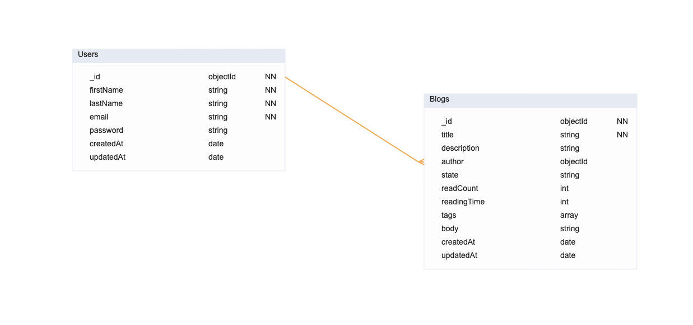

# Blogging API

### How to run

- Install all packages.
- Create environment variables in a .env file using the .env.sample template
- Run project in root folder with `npm start` .

### API Documentation

[Click here.](https://documenter.getpostman.com/view/4304944/2sA3Bq3WGf)

#### Entity Relationship Diagram

- DB: MongoDB

